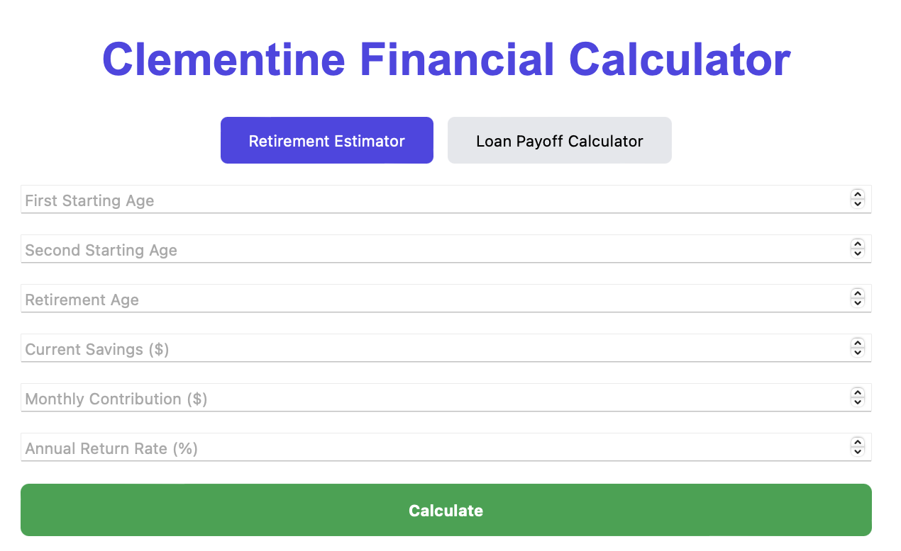

# 💼 Retirement & Loan Payoff Calculator

A modern, responsive web app built in React that helps users:

- Estimate **total retirement savings** based on starting age, contributions, and return rate.
- Calculate how long it will take to **pay off a loan**, and how much faster it could be paid off by adding $15/month.

🔗 **Live Demo:** [https://your-netlify-site.netlify.app](https://retirementcalculatortrisha.netlify.app)  
📁 **GitHub Repo:** [https://github.com/TrishaAndres/retirement-calculator](https://github.com/TrishaAndres/retirement-calculator-react)


---

## ✨ Features

- 🧮 Dual calculators: Retirement & Loan payoff
- 📊 Real-time, interactive form input and results
- 📱 Fully responsive, clean layout
- 🔁 Reusable calculation logic
- 🧠 Ported from original C++ CLI version

---

## 📸 Preview



> 📸 Screenshot of the online calculator!

---

## 🛠 Tech Stack

- **Frontend:** React, JavaScript
- **Styling:** Plain CSS (or Tailwind if added)
- **Build Tool:** Create React App

---

## 🚀 Setup Instructions

1. Clone the repo:
   ```bash
   git clone https://github.com/TrishaAndres/retirement-calculator.git
   cd retirement-calculator
2. Install dependencies:
   npm install
3. Run the app:
   npm start
